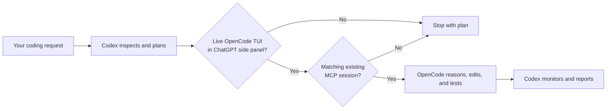

# OpenCode Side-Panel Orchestrator

[](LICENSE)
[](#requirements)

A Codex skill that keeps Codex in the planner's chair and delegates implementation to **your existing OpenCode side-panel session—only while that session is visibly open**.

It does not launch OpenCode, create a replacement session, refresh the panel, or quietly fall back to Codex for coding.

## Why this exists

OpenCode MCP can retain sessions after its terminal UI closes. Session history alone therefore cannot prove that the OpenCode session in the ChatGPT/Codex desktop side panel is still open.

This skill uses two independent gates before delegating:

1. A read-only process-tree check finds an interactive `opencode` TUI beneath the ChatGPT desktop app.
2. OpenCode MCP must expose an existing session for the current repository.

If either gate fails, Codex produces a plan and stops.



## Requirements

- macOS
- ChatGPT/Codex desktop app with a side-panel terminal
- [OpenCode](https://opencode.ai/) installed and authenticated
- [Codex](https://developers.openai.com/codex/) with MCP support
- Node.js 18 or newer, for `npx`
- Python 3, for the zero-dependency live-session detector
- [`opencode-mcp`](https://github.com/AlaeddineMessadi/opencode-mcp)

The live UI detector currently targets the macOS ChatGPT desktop process hierarchy. It fails closed on unsupported platforms.

## Quick start

### 1. Connect OpenCode MCP to Codex

```bash
codex mcp add opencode -- npx -y opencode-mcp
```

Restart the ChatGPT/Codex desktop app after changing MCP configuration. Verify the registration with:

```bash
codex mcp list
```

For longer implementation tasks, you can set timeouts in `~/.codex/config.toml`:

```toml
[mcp_servers.opencode]
command = "npx"
args = ["-y", "opencode-mcp"]
startup_timeout_sec = 30
tool_timeout_sec = 600
default_tools_approval_mode = "writes"
```

See the official [Codex MCP documentation](https://learn.chatgpt.com/docs/extend/mcp) for configuration and trust guidance.

### 2. Install the skill

Install globally so it is available in every project:

```bash
npx skills add DehydratedFlask/opencode-sidepanel-orchestrator --skill opencode-sidepanel-orchestrator -g -y
```

Or omit `-g` for a project-local installation:

```bash
npx skills add DehydratedFlask/opencode-sidepanel-orchestrator --skill opencode-sidepanel-orchestrator -y
```

Restart Codex after installing a new skill.

### 3. Open the session you want Codex to use

In the ChatGPT/Codex desktop side-panel terminal:

```bash
cd /path/to/your/project
opencode
```

Leave that TUI open. The OpenCode MCP server must be able to see its existing session in the same project directory.

### 4. Delegate

Explicit invocation:

```text
Use $opencode-sidepanel-orchestrator to implement the new settings screen.
```

The skill also allows implicit invocation for coding work when your request makes the planner/delegator intent clear, for example:

```text
Plan this refactor, then have my open side-panel OpenCode session implement and test it.
```

## What it does

| Side-panel TUI | Matching MCP session | Result |
|---|---|---|
| Open | Found | Codex plans; OpenCode implements and tests; Codex monitors |
| Open | Missing | Codex stops with the plan and asks you to open/select the project session |
| Closed | Persisted session exists | Codex stops; stale history does not pass the live UI gate |
| Closed | Missing | Codex stops |
| Multiple matches | Multiple | Codex asks you to choose by title/session ID |

Codex communicates through `opencode_reply`, which continues the chosen session. It does not use session-creation tools, and it leaves the session's existing model/provider selection untouched.

## Verify the live-session detector

For a global install:

```bash
python3 ~/.agents/skills/opencode-sidepanel-orchestrator/scripts/detect_sidepanel_opencode.py --pretty
```

When the side-panel TUI is open, the command returns JSON with `"open": true` and exits `0`. If it is closed, it returns `"open": false` and exits `1`. Unsupported platforms or detector errors exit `2`.

The script only reads the process table. It never focuses, types into, refreshes, or closes the terminal.

## Manual installation

```bash
git clone https://github.com/DehydratedFlask/opencode-sidepanel-orchestrator.git
mkdir -p ~/.agents/skills
cp -R opencode-sidepanel-orchestrator ~/.agents/skills/opencode-sidepanel-orchestrator
```

Restart Codex after copying the skill.

## Troubleshooting

### Codex says the side panel is closed

- Confirm the interactive `opencode` TUI is still visible in the desktop side-panel terminal.
- Do not confuse the MCP backend's `opencode serve` process with the TUI; the backend intentionally does not satisfy the gate.
- Run the detector command above and inspect its JSON result.

### MCP tools are unavailable

```bash
codex mcp list
npx -y opencode-mcp
```

Confirm `opencode` is on your `PATH`, then restart the desktop app. Use `Ctrl+C` to stop the second diagnostic command after it starts successfully.

### No matching session is found

Start OpenCode from the same absolute project directory used by Codex. If several sessions match, tell Codex which displayed title or session ID to use.

### The skill does not appear

Restart Codex and confirm `SKILL.md` exists at:

```text
~/.agents/skills/opencode-sidepanel-orchestrator/SKILL.md
```

## Safety model

- Fails closed when live UI state cannot be proven.
- Uses an existing session; never creates, forks, deletes, reverts, aborts, or disposes one.
- Keeps Codex read-only during implementation.
- Does not commit, push, publish, deploy, or run destructive operations unless you explicitly authorize them.
- Sends only the implementation context needed for the current repository.

MCP servers can execute code with your account's permissions. Review third-party MCP source and configuration before enabling it.

## Uninstall

```bash
npx skills remove opencode-sidepanel-orchestrator -g -y
```

Remove the MCP registration separately if you no longer use it:

```bash
codex mcp remove opencode
```

## Development

Run the zero-dependency unit tests and skill validator:

```bash
python3 -m unittest discover -s tests -v
python3 /path/to/skill-creator/scripts/quick_validate.py .
```

The detector accepts `--ps-file` for deterministic fixtures and debugging without touching live UI state.

## Design references

The README structure and distribution flow were informed by established agent-skill repositories such as [delegate-skills](https://github.com/amElnagdy/delegate-skills) and [terminal-control](https://github.com/anomalyco/terminal-control). Packaging follows the [Agent Skills CLI](https://skills.sh/) convention, while repository documentation follows [GitHub's README guidance](https://docs.github.com/en/repositories/managing-your-repositorys-settings-and-features/customizing-your-repository/about-readmes).

## License

[MIT](LICENSE) © John Wang
