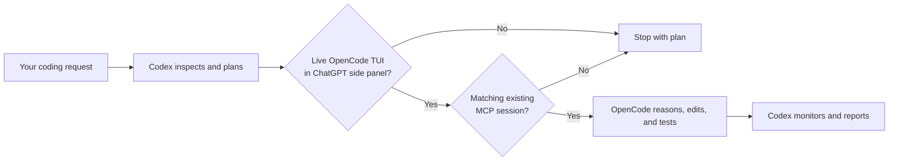

# Codex Side-Panel Orchestrator — Delegate Coding to OpenCode

[](LICENSE)
[](#platform-support)

A cross-platform **Codex skill for OpenCode delegation** that turns Codex into a planning orchestrator and sends implementation work through **OpenCode MCP** to your existing OpenCode side-panel session—only while that session is visibly open.

Use it to connect Codex with OpenCode for AI coding tasks, refactoring, debugging, and test generation without launching a replacement OpenCode session or quietly falling back to Codex for coding.

## What is Codex Side-Panel Orchestrator?

Codex Side-Panel Orchestrator is an open-source agent skill for the ChatGPT/Codex desktop app. Codex inspects the repository and creates the implementation plan; OpenCode performs the reasoning, file edits, and tests through an existing terminal session exposed by `opencode-mcp`.

### Key features

- **Codex-to-OpenCode delegation:** Codex plans and supervises while OpenCode implements.
- **Existing-session only:** the skill never creates or substitutes an OpenCode coding session.
- **OpenCode MCP integration:** uses OpenCode's supported shared-server TUI controls, preserving the model selected in the panel.
- **Live side-panel detection:** rejects stale MCP history when the OpenCode TUI is closed.
- **Cross-platform setup:** supports macOS and native Windows desktop workflows, with fail-closed Linux detection.
- **Read-only orchestration:** Codex does not edit project files during delegated implementation.

## Why delegate Codex coding tasks to OpenCode?

OpenCode MCP can retain sessions after its terminal UI closes. Session history alone therefore cannot prove that the OpenCode session in the ChatGPT/Codex desktop side panel is still open.

This skill uses three independent gates before delegating:

1. A read-only process-tree check finds exactly one interactive `opencode attach <url>` TUI beneath the ChatGPT desktop app.
2. OpenCode MCP must use that same server URL and expose an existing session for the repository.
3. The selected session must be idle and match the project and, when supplied, the user's title or ID.

If either gate fails, Codex produces a plan and stops.



## Requirements

- macOS, Windows, or Linux for installation and detection
- ChatGPT/Codex desktop app with a side-panel terminal for live delegation
- [OpenCode](https://opencode.ai/) installed and authenticated (a fresh install is fine)
- [Codex](https://developers.openai.com/codex/) with MCP support
- Git, used by the skill installer
- Node.js 18 or newer, for `npx`
- Python 3, for the zero-dependency live-session detector
- [`opencode-mcp`](https://github.com/AlaeddineMessadi/opencode-mcp)

`opencode-mcp` is a bridge used by Codex. You do not install a skill or plugin inside OpenCode. With the `npx` configuration below, Node downloads the bridge automatically on first use.

## Install the Codex OpenCode orchestrator

### 1. Install and initialize OpenCode

If OpenCode is already installed, skip the installation command. The npm method works on macOS, Windows PowerShell, and Linux:

```bash
npm install -g opencode-ai
opencode --version
```

Run `opencode` once and complete its provider authentication before delegating work. Other official installation options are listed on the [OpenCode download page](https://dev.opencode.ai/download).

### 2. Connect OpenCode MCP to Codex

Start the shared OpenCode server in a regular terminal and leave it running:

```bash
opencode serve --hostname 127.0.0.1 --port 4096
```

Then register the MCP bridge against that server. Disabling auto-serve makes connection mistakes fail visibly instead of silently starting a second backend:

```bash
codex mcp add opencode \
  --env OPENCODE_BASE_URL=http://127.0.0.1:4096 \
  --env OPENCODE_AUTO_SERVE=false \
  -- npx -y opencode-mcp
```

Restart the ChatGPT/Codex desktop app after changing MCP configuration. Verify the registration with:

```bash
codex mcp list
```

For longer implementation tasks, you can set timeouts in `~/.codex/config.toml`:

```toml
[mcp_servers.opencode]
command = "npx"
args = ["-y", "opencode-mcp"]
env = { OPENCODE_BASE_URL = "http://127.0.0.1:4096", OPENCODE_AUTO_SERVE = "false" }
startup_timeout_sec = 30
tool_timeout_sec = 600
default_tools_approval_mode = "writes"
```

See the official [Codex MCP documentation](https://learn.chatgpt.com/docs/extend/mcp) for configuration and trust guidance.

This command is sufficient for a fresh OpenCode setup; no OpenCode-side MCP skill is needed. `npx -y` fetches `opencode-mcp` when Codex starts it.

### 3. Install the skill

Install globally so it is available in every project:

```bash
npx skills add DehydratedFlask/codex-sidepanel-orchestrator --skill codex-sidepanel-orchestrator -g -y
```

Or omit `-g` for a project-local installation:

```bash
npx skills add DehydratedFlask/codex-sidepanel-orchestrator --skill codex-sidepanel-orchestrator -y
```

Restart Codex after installing a new skill.

### 4. Open the session you want Codex to use

In the ChatGPT/Codex desktop side-panel terminal, attach the TUI to the same server:

```bash
cd /path/to/your/project
opencode attach http://127.0.0.1:4096 --dir "$PWD"
```

PowerShell equivalent:

```powershell
opencode attach http://127.0.0.1:4096 --dir (Get-Location).Path
```

Leave that TUI open and use only one attached OpenCode TUI at a time for unambiguous control.

### 5. Delegate

Explicit invocation:

```text
Use $codex-sidepanel-orchestrator to implement the new settings screen.
```

The skill also allows implicit invocation for coding work when your request makes the planner/delegator intent clear, for example:

```text
Plan this refactor, then have my open side-panel OpenCode session implement and test it.
```

## What it does

| Side-panel TUI | Shared server | Matching MCP session | Result |
|---|---|---|---|
| One attached | Same URL | Found | Codex plans; OpenCode implements and tests; Codex monitors |
| Plain/unattached | No | Found or missing | Codex stops; visible history is not a live control channel |
| One attached | Same URL | Missing | Codex stops with the plan and asks you to open/select the project session |
| Closed | Any | Persisted or missing | Codex stops; stale history does not pass the live UI gate |
| Multiple TUIs | Any | Any | Codex stops because TUI delivery is ambiguous |

Codex uses `opencode_tui_append_prompt` followed by `opencode_tui_submit_prompt` on the shared server. This drives the attached panel and preserves its selected model and agent. The skill does not use the headless `opencode_reply` path for side-panel delegation.

## Verify the live-session detector

macOS or Linux:

```bash
python3 ~/.agents/skills/codex-sidepanel-orchestrator/scripts/detect_sidepanel_opencode.py --pretty
```

Windows PowerShell:

```powershell
python "$HOME\.agents\skills\codex-sidepanel-orchestrator\scripts\detect_sidepanel_opencode.py" --pretty
```

When one attached side-panel TUI is open, the command returns `"open": true`, `"control_ready": true`, and its server URL. A plain `opencode` TUI remains visible but returns `"control_ready": false`; multiple TUIs are also rejected as ambiguous. Closed UI returns `"open": false` and exits `1`. Unsupported platforms or detector errors exit `2`.

The script only reads the process table. It never focuses, types into, refreshes, or closes the terminal.

## Manual installation

macOS or Linux:

```bash
git clone https://github.com/DehydratedFlask/codex-sidepanel-orchestrator.git
mkdir -p ~/.agents/skills
cp -R codex-sidepanel-orchestrator ~/.agents/skills/codex-sidepanel-orchestrator
```

Windows PowerShell:

```powershell
git clone https://github.com/DehydratedFlask/codex-sidepanel-orchestrator.git
New-Item -ItemType Directory -Force "$HOME\.agents\skills" | Out-Null
Copy-Item -Recurse codex-sidepanel-orchestrator "$HOME\.agents\skills\codex-sidepanel-orchestrator"
```

Restart Codex after copying the skill.

## Troubleshooting

### Codex says the side panel is closed

- Confirm the interactive `opencode` TUI is still visible in the desktop side-panel terminal.
- Do not confuse the MCP backend's `opencode serve` process with the TUI; the backend intentionally does not satisfy the gate.
- Run the detector command above and inspect its JSON result.

### MCP tools are unavailable

```bash
codex mcp list
npx -y opencode-mcp
```

Confirm `opencode` is on your `PATH`, then restart the desktop app. Use `Ctrl+C` to stop the second diagnostic command after it starts successfully.

For a fresh OpenCode install, this MCP registration is the only additional integration step. OpenCode itself does not need an `opencode-mcp` skill.

### No matching session is found

Start OpenCode from the same absolute project directory used by Codex. If several sessions match, tell Codex which displayed title or session ID to use.

### Prompts appear in history but the side-panel model does not answer

The MCP bridge is probably talking to an auto-started headless server instead of the side-panel TUI's server. Stop that delegation attempt, configure `OPENCODE_BASE_URL` and `OPENCODE_AUTO_SERVE=false`, then launch the panel with `opencode attach` as shown above. Shared session history alone is not proof of a shared live control channel.

### More than one side-panel TUI is open

Close the unused TUI or leave it untouched and delegate manually. The skill fails closed because the directory-scoped TUI control API cannot reliably identify which of multiple subscribers should receive a prompt.

### The skill does not appear

Restart Codex and confirm `SKILL.md` exists at:

```text
~/.agents/skills/codex-sidepanel-orchestrator/SKILL.md
```

## Safety model

- Fails closed when live UI state cannot be proven.
- Requires one TUI attached to the MCP bridge's exact server URL; never treats shared history as proof of control.
- Uses an existing session; never creates, forks, deletes, reverts, aborts, or disposes one.
- Keeps Codex read-only during implementation.
- Does not commit, push, publish, deploy, or run destructive operations unless you explicitly authorize them.
- Sends only the implementation context needed for the current repository.

MCP servers can execute code with your account's permissions. Review third-party MCP source and configuration before enabling it.

## Platform support

| System | Install and run detector | Live side-panel delegation |
|---|---|---|
| macOS | Yes, using `ps` and TTY ancestry | Yes |
| Windows | Yes, using PowerShell `Win32_Process` ancestry | Yes, for native Windows terminal sessions |
| Linux | Yes, using `ps`; fails closed when no compatible host exists | No official ChatGPT desktop host currently |
| Windows + WSL OpenCode | Detector runs, but fails closed | Not currently supported because the process ancestry crosses the VM boundary |

OpenAI's current desktop documentation lists the ChatGPT/Codex app for [macOS and Windows](https://help.openai.com/en/articles/20001276-moving-to-the-new-chatgpt-desktop-app). Other operating systems remain installable but cannot delegate without a compatible desktop side-panel host.

## Frequently asked questions

### How do I connect Codex to OpenCode?

Install and authenticate OpenCode, register `opencode-mcp` with `codex mcp add opencode -- npx -y opencode-mcp`, install this skill, and restart Codex. The [installation guide](#install-the-codex-opencode-orchestrator) contains the complete commands.

### Can Codex act as an orchestrator for OpenCode?

Yes. This skill keeps Codex focused on repository inspection, planning, acceptance criteria, and monitoring while an existing OpenCode session performs coding and tests.

### Does the skill start a new OpenCode session?

No. Both the live side-panel detector and a matching MCP session must pass before delegation. The skill never launches, creates, forks, or replaces a coding session.

### Do I install `opencode-mcp` inside OpenCode?

No. `opencode-mcp` is an MCP bridge configured in Codex. A fresh OpenCode installation does not need an additional OpenCode skill or plugin.

### Does it work on macOS, Windows, and Linux?

Installation and detection run on all three. Live delegation works with the official ChatGPT/Codex desktop host on macOS and native Windows terminals. Linux and Windows-to-WSL process boundaries fail closed when the side-panel relationship cannot be proven.

## Uninstall

```bash
npx skills remove codex-sidepanel-orchestrator -g -y
```

Remove the MCP registration separately if you no longer use it:

```bash
codex mcp remove opencode
```

## Development

Run the zero-dependency unit tests and skill validator:

```bash
python3 -m unittest discover -s tests -v
python3 /path/to/skill-creator/scripts/quick_validate.py .
```

The detector accepts `--ps-file` for deterministic fixtures and debugging without touching live UI state.

## Design references

The README structure and distribution flow were informed by established agent-skill repositories such as [delegate-skills](https://github.com/amElnagdy/delegate-skills) and [terminal-control](https://github.com/anomalyco/terminal-control). Packaging follows the [Agent Skills CLI](https://skills.sh/) convention, while repository documentation follows [GitHub's README guidance](https://docs.github.com/en/repositories/managing-your-repositorys-settings-and-features/customizing-your-repository/about-readmes).

## License

[MIT](LICENSE) © John Wang
